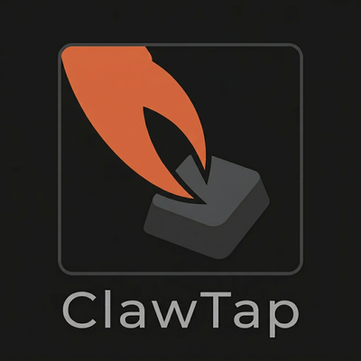

<div align="center">




**Wireless keyboard bridge — type on any computer from your phone or AI assistant**

[](https://pypi.org/project/clawtap-mcp/)
[](https://github.com/list91/clawtap-mcp/actions/workflows/test.yml)
[](LICENSE)

</div>

---

A tiny USB stick that receives text over Bluetooth and types it as a real USB keyboard. Works with Claude, any MCP-compatible AI, or any BLE app on your phone.

```
Phone / AI  →  BLE  →  ClawTap  →  USB HID  →  💻
```

## Quick Start

```bash
claude mcp add clawtap -- uvx clawtap-mcp
```

Or install manually:

```bash
pip install clawtap-mcp
```

## MCP Tools

| Tool | What it does |
|------|-------------|
| `type_text(text)` | Type text as keystrokes. Supports ASCII + Cyrillic |
| `press_key(key, count)` | Press a special key: `enter`, `escape`, `backspace`, `f1`–`f12`, arrows |
| `combo_keys(keys)` | Key combo up to 5 keys: `["ctrl","c"]`, `["alt","tab"]`, `["win","r"]` |
| `health_check()` | Check wireless connection and device status |

### Examples

```python
# Type text
type_text("Hello World!\n")

# Cyrillic (target must have RU layout active)
type_text("Привет мир")

# Key combos
combo_keys(["ctrl", "c"])      # Copy
combo_keys(["alt", "tab"])     # Switch window
combo_keys(["win", "r"])       # Run dialog

# Special keys
press_key("backspace", 5)      # Delete 5 chars
press_key("enter")
```

## Troubleshooting

| Problem | Fix |
|---------|-----|
| Device not found | Power cycle device. Make sure no other app is connected to it |
| Wrong characters | Check keyboard layout on target computer (EN for English, RU for Cyrillic) |
| Disconnects | Stay within 10m. Check USB power stability |

## FAQ

**Does the target need any software installed?**
No. The target sees a plain USB keyboard — no drivers, no agent, no admin
rights. That's the whole point: ClawTap works on kiosks, industrial HMIs,
locked-down corporate laptops, BIOS screens, and anywhere Selenium /
Playwright cannot reach.

**What's the typical end-to-end latency?**
For a single key, ~30–80 ms from MCP tool call to the character landing on
the target (BLE round-trip dominates). For a 1000-character paragraph,
expect roughly 1–2 seconds of streaming.

**Which operating systems can host the MCP server?**
Anywhere `bleak` works: Windows 10/11, macOS 10.15+, Linux with BlueZ. The
*target* (the machine plugged into ClawTap via USB) can be literally
anything that accepts a USB HID keyboard, including Android, game consoles,
and Raspberry Pi.

**Does ClawTap see what's on the target screen?**
No. The link is one-way — host → ClawTap → target. There is no return
channel and no camera. If you want a feedback loop (AI reads what it just
typed), point a phone camera at the target screen and pipe that through
your own MCP image source.

**Can the device type non-ASCII without changing the target's layout?**
No. ClawTap is a deterministic HID channel: it sends US-QWERTY scancodes,
the OS interprets them under the active layout. Cyrillic works by mapping
characters to the keys that produce them in the RU layout — switch with
`Win+Space` (Windows) on the target before sending.

**Is the BLE link encrypted?**
Pairing uses BLE Just Works (no MITM protection); after that the channel
is encrypted with the link key. Treat ClawTap as you would a wireless
keyboard — fine for personal use, not a substitute for a hardened
authentication channel.

**Can I drive several ClawTap devices from one host?**
Not yet. The current MCP server keeps a single BLE client. Extending it to
a pool keyed by device name is on the roadmap — see [examples/](examples/)
for the patterns that need to be parameterised.

**Where do I look next?**
- [`examples/`](examples/) — five short scripts (clipboard, Cyrillic, browser
  launcher, vim session, stress test).
- [`CONTRIBUTING.md`](CONTRIBUTING.md) — for bug reports and PRs.

## License

MIT

---

